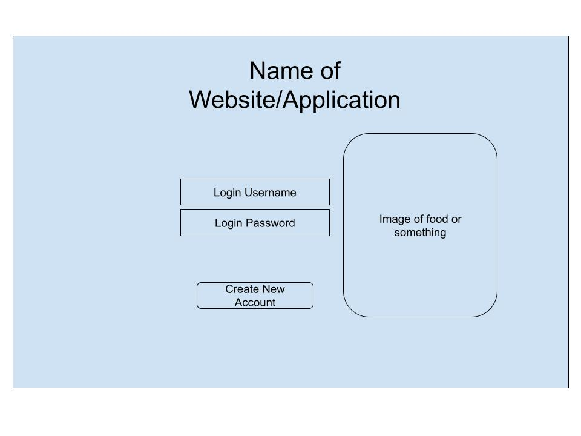
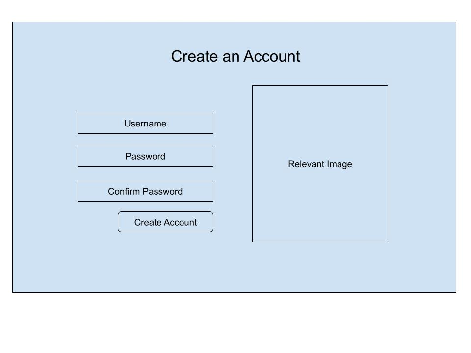
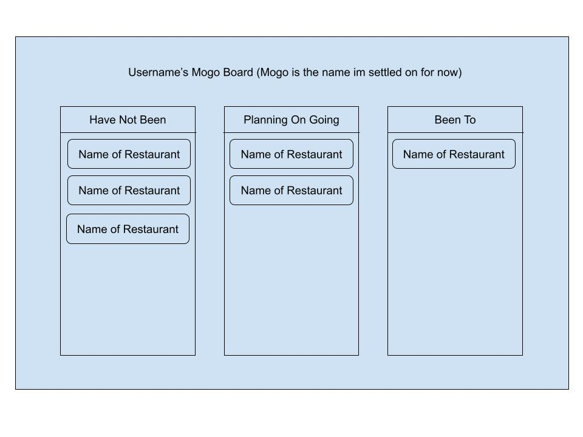
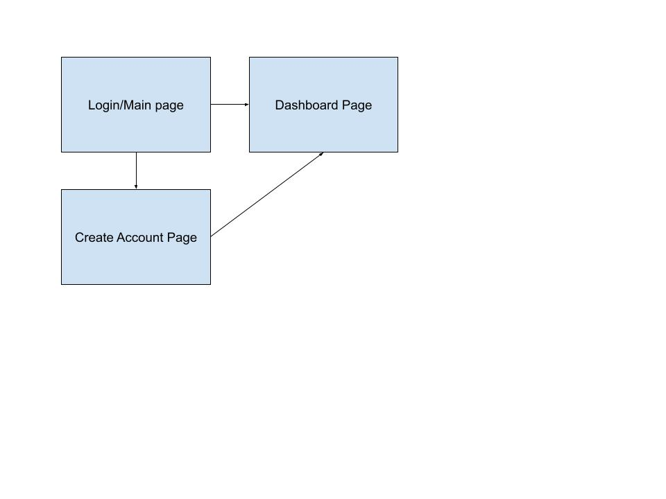

The content below is an example project proposal / requirements document. Replace the text below the lines marked "__TODO__" with details specific to your project. Remove the "TODO" lines.

(__TODO__: your project name)

# Shoppy Shoperson 

## Overview

(__TODO__: a brief one or two paragraph, high-level description of your project)

Mogo (먹어 to eat in korean) is an app that combines project management
organization and my love for food to help me have places to eat. Once they log
in and register, they can create their own boards of places they want to eat at.
Basically a Asana had a kid with Yelp

## Data Model

(__TODO__: a description of your application's data and their relationships to each other) 

The application will store Users, The state of their kanban boards, as well as a
large database of places to eat (to help with auto filling etc.).

In the kanban boards, they'll have tokens/containers with info containing name
of the resturant, type of cuisine, and some tokens to give it more info
- these tokens might be things like "cheap eats, fast food, good for dates, etc."


* users can have multiple lists (via references)
* each list can have multiple items (by embedding)

(__TODO__: sample documents)

An Example User:

```javascript
{
  username: "adventurousfoodie",
  hash: // a password hash,
}
```

An Example List with Embedded Items:

```javascript
{
  restaurant_name: "Jasper Kane"
  location: "6 Metrotech Brooklyn NY"
  status: "Have Not Been"/"Plans are made"/"Have Gone"
}
```

## [Link to Commented First Draft Schema](db.mjs) 

(__TODO__: create a first draft of your Schemas in db.mjs and link to it)

## Wireframes

(__TODO__: wireframes for all of the pages on your site; they can be as simple as photos of drawings or you can use a tool like Balsamiq, Omnigraffle, etc.)

/login - opening login page


/create - where you create an account
\

/dashboard - where you can view your kanban board


Selenium Testing: 

## Site map

(__TODO__: draw out a site map that shows how pages are related to each other)



Here's a [complex example from wikipedia](https://upload.wikimedia.org/wikipedia/commons/2/20/Sitemap_google.jpg), but you can create one without the screenshots, drop shadows, etc. ... just names of pages and where they flow to.

## User Stories or Use Cases

(__TODO__: write out how your application will be used through [user stories](http://en.wikipedia.org/wiki/User_story#Format) and / or [use cases](https://en.wikipedia.org/wiki/Use_case))

1. as non-registered user, I can register a new account with the site
2. as a user, I can log in to the site
3. as a user, I can have a dashboard for places of food
4. As a user, I can make changes to my kanban board/dashboard
5. as a user, I can use this to check where I can go eat
6. As a user, I can add places and restaurants that im interested in based on
   name, or address


## Research Topics

(__TODO__: the research topics that you're planning on working on along with their point values... and the total points of research topics listed)

Keeping these in case I do use them, adding more

* Tailwind (2 points): Tailwind is a styling css tool to make it easier/add more customization
* given it says 2 points in the rubric, i will delegate 2 points here
* Tailwind was used (and customized) to create the purpley nyu-esque aesthetic you're seeing on my web app


* Selenium (5pts): Selenium was used to test the home, register, login, and dashboard routes.
* given it also says 5pts on the rubric, i will delegate 5pts here
* Selenium is a system used to test the different routes on your web app. 

* Google Maps API (3Pts): Google maps API was used to help add an autocomplete feature on the dashboard. 
* I give this 3 pts because I think there are definitely other APIs that are much more difficult to use, and I also think that
* I used the API in a minor way as part of my project, thus giving it lesser points. 

10 points total out of 8 required points (___TODO__: addtional points will __not__ count for extra credit)


## [Link to Initial Main Project File](app.mjs) 

(__TODO__: create a skeleton Express application with a package.json, app.mjs, views folder, etc. ... and link to your initial app.mjs)

## Annotations / References Used

(__TODO__: list any tutorials/references/etc. that you've based your code off of)

1. [passport.js authentication docs](http://passportjs.org/docs) - (add link to source code that was based on this)
2. [tutorial on vue.js](https://vuejs.org/v2/guide/) - (add link to source code that was based on this)

